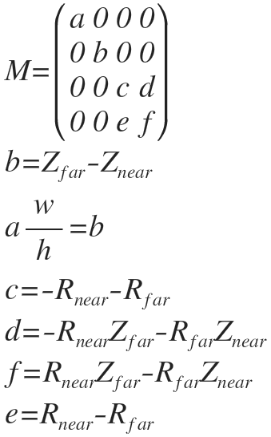
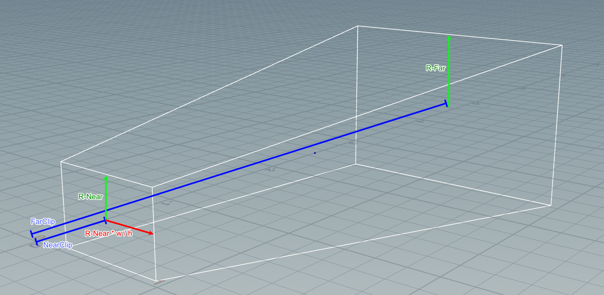

## Generized Perspective

## demo

## The Projection Matrix

<!--

M=\begin{pmatrix} a & 0 & 0 & 0 \\ 0 & b & 0 & 0 \\ 0 & 0 & c & d \\ 0 & 0 & e & f \end{pmatrix}\\ b=Z_{ far }-Z_{ near }\\ a\frac { w }{ h } =b\\ c=-R_{ near }-R_{ far }\\ d=-R_{ near }Z_{ far }-R_{ far }Z_{ near }\\ f=R_{ near }Z_{ far }-R_{ far }Z_{ near }\\ e=R_{ near }-R_{ far }

 -->

 

